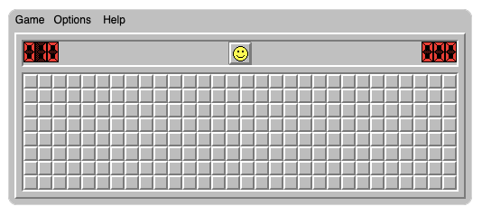

# Minesweeper

Welcome to Minesweeper! This classic puzzle game challenges your strategic thinking and logic skills. 



## Table of Contents

- [Introduction](#introduction)
- [Features](#features)
- [Installation](#installation)
- [Usage](#usage)
- [Contributing](#contributing)

## Introduction

Minesweeper is a game where players uncover squares on a grid to avoid hidden mines. The objective is to clear the board without detonating any mines. Each revealed square provides a clue as to how many mines are adjacent to it, allowing players to deduce safe squares and strategically navigate the grid.

## Features

- Classic Minesweeper gameplay

## Installation

To get started with Minesweeper, follow these steps:

1. **Clone the repository:**

   ```sh
   git clone https://github.com/Brianhuynh97/C-Project-1.git

2. **Navigate to the project directory:**

   ```sh
   cd C-Project-1
   cd code .

3. **Compile the code:**

   ```sh
   g++ minesweeper_game.cpp   
   g++ minesweeper_game.cpp -o minesweeper     

4. **Run the game:**

   ```sh
   ./minesweeper

## Usage
Once you've compiled and run the game, use the following control to play:

Enter the row and column (e.g., 2 3):

The game exits when you step on the mine.

## Contributing
I welcome contributions to improve Minesweeper! If you'd like to contribute, please follow these steps:

Fork the repository.

**Create a new branch:**
   
```sh
   git checkout -b feature-branch
```
**Make your changes and commit them:**
   ```sh
git commit -m "Description of changes"
   ```
**Push to the branch:**
   ```sh
   git push origin feature-branch
   ```
**Create a pull request.**

I'll review and merge your changes if they align with my project's goals.
